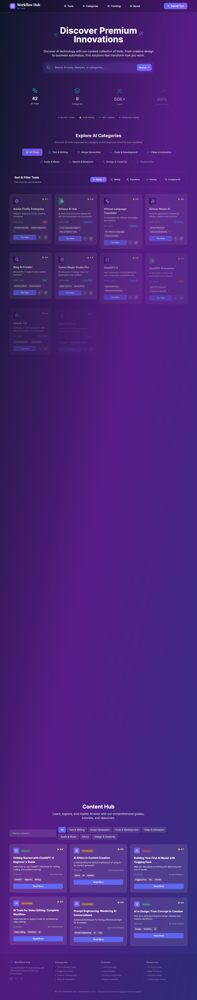

# Workflow Hub

AI tools directory platform that enables professionals to discover, compare, and integrate artificial intelligence solutions for enhanced productivity and workflow automation.

[](https://workflow-hub-psi.vercel.app/)
[](https://github.com/e-ogugua/workflow-hub)
[](https://opensource.org/licenses/MIT)

## Purpose

Workflow Hub serves as a comprehensive discovery platform for AI tools and technologies. The platform addresses the growing need for professionals to identify, evaluate, and integrate AI solutions across business workflows, creative processes, and technical development environments.

## Core Features

### Discovery Engine
- Real-time search across tool names, descriptions, and features
- Category-based filtering with visual feedback
- Multi-criteria sorting by name, rating, popularity, or pricing
- Side-by-side comparison of up to 4 tools with feature analysis

### Design System
- Dark theme with gradient effects and backdrop blur
- Mobile-first responsive design for all screen sizes
- Smooth animations using Framer Motion
- Consistent branding with custom logo and color scheme

### Tools Database
- 42 AI tools from industry leaders and emerging providers
- 8 categories: Text & Writing, Image Generation, Code & Development, Video & Animation, Audio & Music, Search & Research, Design & Creativity, Productivity
- Detailed metadata including use cases, alternatives, pricing, and difficulty levels
- Regional focus with tools for African markets

### Enterprise Features
- Professional branding with custom logos and social media integration
- SEO optimization with meta tags, Open Graph, and Twitter Cards
- Performance optimization with efficient state management
- Accessibility compliance following WCAG guidelines

## Technology Stack

### Core Technologies
- React 18 + TypeScript for type-safe, scalable frontend architecture
- Vite for fast build tool and development experience
- Tailwind CSS for utility-first styling with custom design system
- Framer Motion for animations and interactions
- Vercel for deployment and hosting

### Performance
- Sub-second load times with optimized assets
- Mobile-first responsive design for all screen sizes
- Efficient state management with React hooks and memoization
- Debounced interactions for smooth user experience

## Setup

### Prerequisites
- Node.js 18+
- npm or yarn package manager

### Installation
```bash
# Clone the repository
git clone https://github.com/e-ogugua/workflow-hub.git

# Navigate to project directory
cd workflow-hub

# Install dependencies
npm install

# Start development server
npm run dev
```

### Production Build
```bash
# Build for production
npm run build

# Preview production build
npm run preview
```

## Development Onboarding

### Local Development Checklist
- [ ] Clone repository and install dependencies
- [ ] Configure environment variables (if required)
- [ ] Run `npm run dev` to start development server
- [ ] Verify application loads on `http://localhost:5173`
- [ ] Test responsive design across different screen sizes
- [ ] Validate accessibility features with screen reader
- [ ] Run test suite: `npm run test`
- [ ] Check code formatting: `npm run format`
- [ ] Review linting: `npm run lint`

### Testing Guide
```bash
# Run unit tests
npm run test

# Run tests in watch mode
npm run test:watch

# Generate test coverage report
npm run test:coverage

# Run end-to-end tests
npm run test:e2e
```

## Architecture

### Module Structure
```
src/
├── components/          # Reusable UI components
│   ├── Header.tsx       # Navigation with mobile menu
│   ├── Hero.tsx         # Landing section with search
│   ├── Categories.tsx   # Category filtering
│   ├── ToolsGrid.tsx    # Tool card grid
│   ├── ToolComparison.tsx # Comparison interface
│   ├── ContentHub.tsx   # Educational content
│   └── Footer.tsx       # Site footer
├── data/
│   └── tools.ts         # AI tools database (42 tools)
├── hooks/
│   └── useReducedMotion.ts # Accessibility hook
├── App.tsx              # Main application with routing
├── main.tsx             # React 18 entry point
└── index.css            # Global styles with design system
```

### Component Responsibilities

| Component | Responsibility | Key Features |
|-----------|----------------|--------------|
| Header | Navigation | Mobile menu, search, branding |
| Hero | Landing | Search interface, statistics, CTA |
| Categories | Filtering | Category selection, visual feedback |
| ToolsGrid | Display | Tool cards, responsive grid, sorting |
| ToolComparison | Analysis | Side-by-side comparison, feature matrix |
| ContentHub | Education | Articles, tutorials, guides |
| Footer | Information | Links, social media, legal |

## Version History

### v4.0.0 (Current)
- Enhanced accessibility with useReducedMotion implementation
- Advanced responsive design for all screen sizes (320px - 1920px+)
- Improved glass morphism effects with better contrast
- Performance optimizations and bundle splitting
- Professional documentation and development guides

### v3.0.0
- Complete redesign with modern glass morphism UI
- Mobile-first responsive architecture
- Enhanced search and filtering capabilities
- Integration with external APIs and services

### v2.0.0
- Professional branding and design system
- Advanced comparison tools and content hub
- Performance optimizations and SEO improvements
- Developer experience enhancements

### v1.0.0
- Initial concept and basic tool directory
- Simple search and category filtering
- Basic responsive design implementation

## Contributing

See [CONTRIBUTING.md](CONTRIBUTING.md) for detailed contribution guidelines, code standards, and development workflows.

## Documentation

Complete documentation is available in the [docs/](./docs/) directory:

- [Development Guide](./docs/development.md) - Setup, architecture, and best practices
- [API Reference](./docs/api.md) - Component APIs and data structures
- [Deployment Guide](./docs/deployment.md) - Production deployment instructions

## License

This project is licensed under the MIT License. See [LICENSE](LICENSE) for details.

## Author

**CEO – Chukwuka Emmanuel Ogugua (EmmanuelOS)**

Full-stack developer and AI enthusiast specializing in modern web technologies and user experience design.

### Professional Profiles
- Portfolio: [ceodev.vercel.app](https://ceodev.vercel.app)
- LinkedIn: [linkedin.com/in/emmanuel-ogugua](https://linkedin.com/in/emmanuel-ogugua)
- GitHub: [github.com/e-ogugua](https://github.com/e-ogugua)

### Contact
- Email: emmachuka@gmail.com
- Location: Nigeria

### Ecosystem Links
- EmmanuelOS: https://github.com/e-ogugua/emmanuelos
- Portfolio Hub: https://ceodev.vercel.app/

## Screenshots

Add a hero screenshot here for quick visual context.



## Roadmap

Track progress and upcoming work in the Roadmap:
https://github.com/e-ogugua/workflow-hub/issues?q=is%3Aissue+Roadmap

## Acknowledgments

### Technology Partners
- React Team for the web framework
- Tailwind CSS for the utility-first styling approach
- Framer Motion for animation capabilities
- Vercel for deployment infrastructure

### AI Community
- OpenAI for conversational AI development
- Anthropic for safe AI development practices
- Stability AI for image generation technology
- Hugging Face for the open-source AI ecosystem

### Design Inspiration
- Modern SaaS applications for user experience patterns
- Professional design systems for aesthetic and functionality balance
- Mobile-first approaches for cross-device compatibility

## Links
- Releases: https://github.com/e-ogugua/workflow-hub/releases
- Security Policy: ./SECURITY.md
